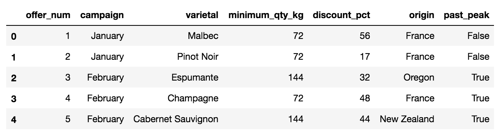

## Customer Segmentation [[view code]](http://nbviewer.jupyter.org/github/marcotav/unsupervised-learning/blob/master/pca/notebooks/pca-wines.ipynb) 
     

**The code is available [here](http://nbviewer.jupyter.org/github/marcotav/unsupervised-learning/blob/master/pca/notebooks/pca-wines.ipynb) or by clicking on the [view code] link above.**

  <a href="#intro"> Introduction </a> •
  <a href="#data"> Dataset </a> •

 

### Introduction
[[go back to the top]](#Table-of-contents)

This notebook describes how to perform market segmentation using machine learning algorithms. As usual, Wikipedia provides a very thorough definition:

> Market segmentation is the process of dividing a broad consumer or business market, normally consisting of existing and potential customers, into sub-groups of consumers (known as segments) based on some type of shared characteristics. In dividing or segmenting markets, researchers typically look for common characteristics such as shared needs, common interests, similar lifestyles or even similar demographic profiles. The overall aim of segmentation is to identify high yield segments – that is, those segments that are likely to be the most profitable or that have growth potential – so that these can be selected for special attention (i.e. become target markets).

I will show how to apply two clustering algorithms to this task:
- K-Means clustering
- Density-Based Spatial Clustering of Applications with Noise (DBSCAN)

This notebook was inspired by this [exceptional post](http://blog.yhat.com/posts/customer-segmentation-using-python.html).

## Dataset

[[go back to the top]](#Table-of-contents)

The dataset is from this [book](https://www.amazon.com/Data-Smart-Science-Transform-Information-ebook/dp/B00F0WRXI0/ref=mt_kindle?_encoding=UTF8&me=). It contains two tables:
- The first contains information about offers including minimum purchase requirement, discounts offered and information about the wines: 
 
 

  

 
- The other shows which offers were accepted by which customers: 
 
 

  

 

